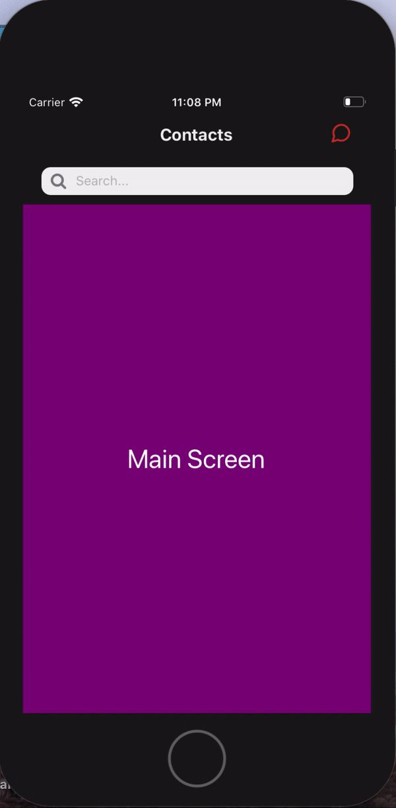

<p>
  <a href="https://www.npmjs.com/package/react-native-animated-searchbar">
    
  </a>
</p>

# React Native Animated Searchbar for easy usage

## :star: Screenshot



## :arrow_down: Installation


```sh

$ yarn add react-native-animated-searchbar

or

$ npm install --save react-native-animated-searchbar

```

## :flashlight: Example Usage
```sh
import React from 'react';
import { View, StyleSheet, Text } from 'react-native';
import Fontawesome from 'react-native-vector-icons/FontAwesome';
import Feather from 'react-native-vector-icons/Feather';
import AnimatedSearchbar from 'react-native-animated-searchbar';
import { SearchScreen } from './SearchScreen'
Fontawesome.loadFont();
Feather.loadFont();


export const Example = () => {

    const HeaderRight = <View style={styles.rightSide}>
        <Feather name={"message-circle"} size={24} color={"#d32f2f"} />
    </View>

    const SearchBarIcon = <View style={styles.baricon}>
        <Fontawesome name={"search"} size={18} color={"gray"} />
    </View>


    return (
        <AnimatedSearchbar
            headerRight={HeaderRight}
            searchBarIcon={SearchBarIcon}
            searchScreen={<SearchScreen />}
            onChangeText={(text) => console.log(text)}
            title={"Contacts"}
        >
            <View style={styles.mainView}>
                <Text style={styles.text}>Main Screen</Text>
                {/* Your screen */}
            </View>
        </AnimatedSearchbar>
    );
}

const styles = StyleSheet.create({
    rightSide: {
        flex: 1,
        alignSelf: 'stretch',
        flexDirection: 'row',
        justifyContent: 'flex-end',
        alignItems: 'center',
        marginRight: 20
    },
    baricon: {
        alignSelf: 'stretch',
        justifyContent: 'center',
        marginLeft: 10
    },
    mainView: {
        flex: 1,
        justifyContent: 'center',
        alignItems: 'center',
        backgroundColor: 'purple'
    },
    searchScreen: {
        flex: 1,
        justifyContent: 'center',
        alignItems: 'center',
        backgroundColor: 'green'
    },
    text: {
        fontSize: 28,
        color: "white"
    }
})


```
## :paperclip: Config

| Params | Type | Default | Required | Description |
| --- | --- | --- | --- | --- |
| backgroundColor | string | #191919 | NO | Background color of the hader |
| animationDuration | number | 150 | NO | Component animation duration |  
| headerRight | Component | - | NO | Right side of the header. You can put your custom component. |
| headerLeft | Component | - | NO | Left side of the header. You can put your custom component. |
| title | string | Title | No | Title text of the component |
| cancelText | string | Cancel | NO | Cancel text of the searchbar |
| cancelTextStyle | StyleSheet | - | NO | Styles of the cancel text |
| cancelTextMarginRight | number | 20 | NO | Margin right of the cancel text |
| placeholder | string | Search... | NO | Placeholder of the search bar |
| searchbarStyle | StyleSheet | - | NO | Style of the search bar |
| placeholderTextColor | string | gray | NO | Placeholder color of the searchbar |
| onPressCancel | func | - | NO | Run on press cancel text |
| onFocus | func | - | NO | Run on focus search bar |
| onChangeText | func | - | NO | Run on change text |
| headerHeight | number | 50 | NO | Header height without searchbar |
| searchBarIcon | Component | -| NO | Searchbar icon |
| searchScreen | Component | - | NO | Second screen for search. Open on focus search bar |


